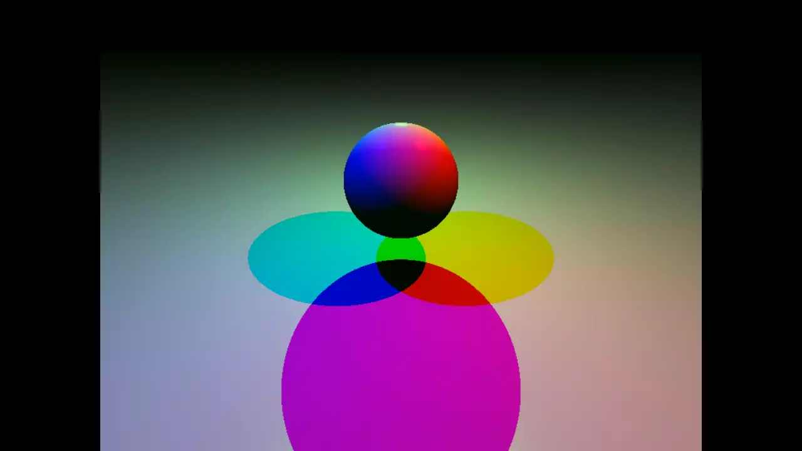

 

# RT
RT-raytracer project for Hive

Made by Esukava and Eniini, returned by Esukava.

Simple Raytracer program that simulates light and shadow in space.

Features:
	-Four basic shapes
	-multiple light sources
	-light colors
	-ambient light, colored
	-phong
	-mirror sphere
	-square texture from file
	-generated checker-board texture
	-grayscale button
	-.bmp screencap
	-moveable lightsource
	-cool parser
	-supports up to 200 objects per scene
